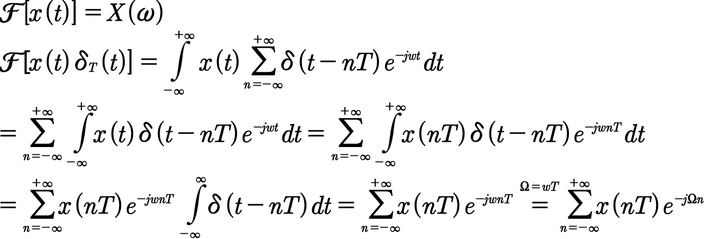

## DTFT
我们知道，采样后信号的频谱是采样前信号的频谱在频域上以采样频率f~s~进行周期延拓而成的，而要想从中恢复出原来信号，就需要对采样频率f~s~和有用信号的上限频率f~0~有一定要求，具体需要满足奈奎斯特采样定理，即要求 **f~s~≥2f~0~**，而DTFT是对已采样信号求频谱的一种方式，公式的推导可以由采样的信号进行傅里叶变换得出。具体可见下面推导。  
  

注意：对采样信号进行DTFT所得出的结果和我们进行频谱搬移得出的结果是一致的，只是从不同的角度得出的罢了，一个是从公式的角度计算出频谱，一个是以一个更为直观、更方便记忆的角度去分析的